# Code/Build/Debug Challenge
# Main Scenario
## Getting Started

1. Login to the workshop system using the given URL, username, and password, and follow the steps your instructor provides

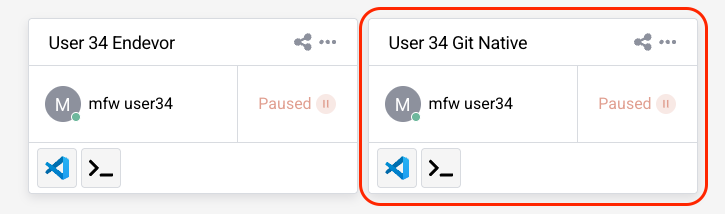

2. You are in the secure cloud environment which runs VS Code and is connected to the Mainframe
3. Make sure the initial build process has been completed successfully (**exit code: 0** message in the active terminal)
4. Close the terminal from it's right top corner

## Get familiar with the VSCode Activity Bar
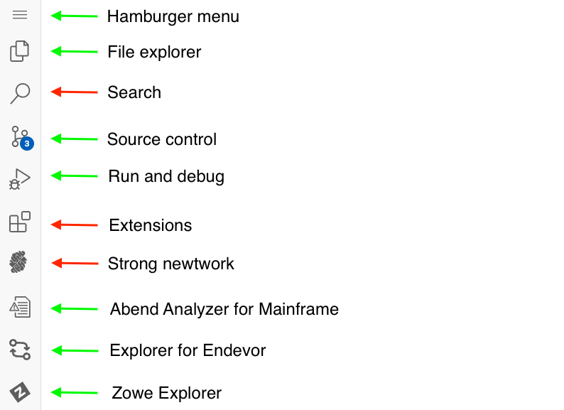

## Build the DOGGOS application

1. Click on the hamburger menu (three lines) icon at the top of the sidebar
2. Select Terminal → Run Build Task 

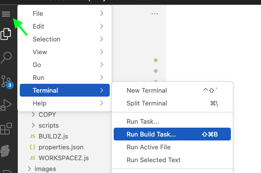

3. After starting the build task, the terminal window will open, after the synchronisation and building of the application on the mainframe, you will get a success message (**exit code:0**)
4. Close the terminal from it's right top corner

## Run the DOGGOS application
Before making any modifications, it is important to understand how the DOGGOS application currently functions. Running the application allows you to verify its expected behavior, ensuring that all dependencies are properly set up and that the build process was successful. This step helps establish a baseline before making any changes so that you can later compare the output after modifications.

1. Go to Zowe Explorer (Z icon in the VS Code Activity Bar)
2. Hover over the “zosmf” item in the DATA SET section in the sidebar and click on the magnifier icon. Enter CUST0xy.PUBLIC in the search field and hit enter (Note: CUST0xy is the mainframe user ID shared by your instructor)
3. Expand the CUST0xy.PUBLIC.JCL data set and right-click on the RUNDOG
4. Select “Submit Job” menu item, then click "Submit" from the pop-up window 
5. Click on the JOB number in the pop-up message in the right bottom corner to see the JOB output (If the notification disappears, you can access it by clicking the bell icon in the bottom-right corner)
6. Expand the “RUNDOG(JOBxxxxx)” in the JOBS section and click on the RUN:OUTREP to browse the program output (If you cannot expand the job output, repeat this step)
7. The report will show the dog breeds categorized. Any breeds not explicitly listed in the COBOL code will fall into the OTHER category.

## Edit the DOGGOS application
Now that you’ve seen the output of the DOGGOS application, it’s time to modify it. The goal here is to introduce a new dog breed into the program so that it appears in the execution report instead of being categorized under “OTHER.” This exercise will teach you how to modify COBOL code and make programmatic changes to a mainframe application.

1. Navigate back to the File Explorer Tab to see the local files
2. Open DOGGOS → COBOL → DOGGOS.CBL file
3. Copy the block of code from lines 59-61 (You can use CTRL+G to jump into the given line number)
4. Paste it after line 61

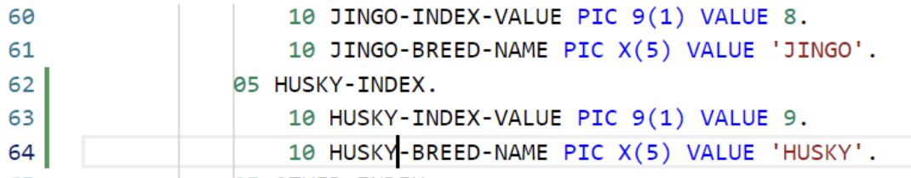

5. Replace JINGO with another dog breed name (e. g. HUSKY) in the whole pasted block of code
6. Update HUSKY-INDEX-VALUE to 9
7. Update OTHER-INDEX-VALUE to 10
8. Change PIC 9(1) to PIC 9(2) for OTHER-INDEX-VALUE
9. Update the OCCURS value in line 71 to 10
10. Copy the block of code from lines 208-210 and paste it after line 210, replacing JINGO with the new breed you defined
11. Copy the block of code from lines 139-142 and paste it after line 143, again replacing JINGO with the new breed you defined
12. Save your changes using CTRL+S (or COMMAND+S on macOS)

To apply these changes, you will need to rebuild the application:

## Build the DOGGOS application

*(Building the application can be done by either following the initial build steps above just like following ```Hamburger Menu → Terminal → Run Build Task``` OR by following the Command Line Instructions below):*

1. Click on the hamburger menu (three lines) icon at the top of the sidebar
1. Select Terminal → New Terminal
1. Make sure the command line starts with: ```developer@ws-<"a-long-number-here">:~/devx-native```
1. Issue the following command to build and deploy the application to a data set: ```syncz -c "bldz"``` and hit Enter key
	(Click “Allow or Paste” if you see the pop-up window asking about copying and pasting permissions)


## Run the DOGGOS application AFTER the change is made and the build run
After making changes to the application, it is crucial to verify that your modifications were successful. Running the application again will ensure that your newly added dog breed appears in the output report. This step confirms that the COBOL code changes were correctly implemented and that the program behaves as expected.

1. Go to Zowe Explorer (Z icon in the VS Code Activity Bar)
2. Hover the “zosmf” item in the DATA SET section in the sidebar and click on the magnifier icon. Enter CUST0xy in the search field and hit enter. Note that CUST0xy is the mainframe user id that is shared by your instructor.
3. Click on the CUST0xy.PUBLIC.INPUT data set  to edit it
4. Add the following lines with the name of the dog breed you chose in the code change
   
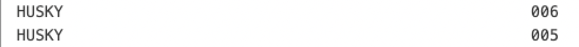

   Please note to enter two records for HUSKY as listed in above screenshot. 

5. Save your changes using CTRL+S (or COMMAND+S on macOS)
6. Expand the CUST0xy.PUBLIC.JCL dataset and right-click on the RUNDOG
7. Select the “Submit Job” menu item, then click "Submit" from the pop-up window
8. Click on the JOB number in the pop-up message at the right bottom corner to see the JOB output (if the notification disappears, you can hit the bell icon from the bottom-right corner to see)
9. Expand the “RUNDOG(JOBxxxxx)” in the JOBS section and click on the RUN:OUTREP to browse the program output (If you cannot expand the job output, repeat this step)

The new dog breed “HUSKY” is listed and the counter reports 11 adopted HUSKY dogs.

## Debug
Bugs can be introduced either during development or when incorrect input data is processed. Debugging helps you analyze and correct such issues by stepping through the code and inspecting variable values. This section will introduce a bug intentionally, and then guide you through using the debugger to identify and fix the issue.

1. Let’s introduce a bug in the program data 🙂 Open the input file again and modify the breed name from “JINGO” to “JINGA”
2. Save your changes using CTRL+S (or COMMAND+S on macOS)
3. Rerun the application by repeating the steps in the previous section (from the 6th step)
4. Open the output file and observe that the report is incorrect, the count for JINGO is now 0 and the OTHER category has absorbed the incorrectly named breed
5. Let’s debug the program
6. Open the Debugger Extension by clicking the play icon with a bug 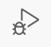 shortcut: CTRL+SHIFT+D (or COMMAND+SHIFT+D)
7. We already have the debugging session preconfigured for the DOGGOS app. Make sure you are using the first configuration (**non-endevor**)

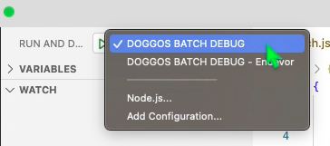

8. Click the play button to start the debugging

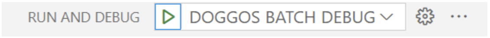

9. You will be asked for your Mainframe password. It is the same as your  mainframe userID. Now the debugger will fetch the extended source and start the session.

**Let's identify where the error occurs**
   
10. The report for the JINGO breed was wrong, so let’s put a breakpoint where the value is updated. Let’s find the first place in the code by searching for JINGO with Ctrl+F (CMD+F on Mac). We can see that processing for the JINGO breed is handled by these variables.
11. Let’s find all instances where JINGO-BREED-NAME is referenced by right-clicking on it and selecting Peek → Peek references. Go through the references to find where the amount is updated. It will be around line 238 in the extended source:

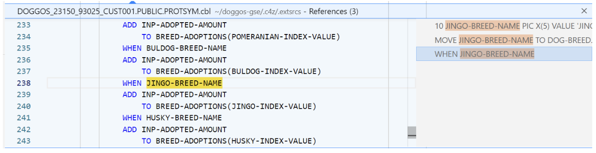

12. Double-click on the 238 line in the editor window to move there.
13. Now set a breakpoint after this condition to see if we get there.
Click on the left area on line 239. The red dot will appear

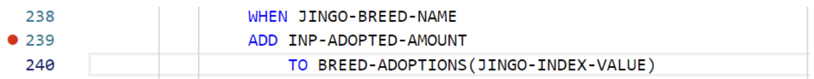

14. The value for OTHER breeds was wrong in the report. Let’s put there a breakpoint as well
That would be on line 245

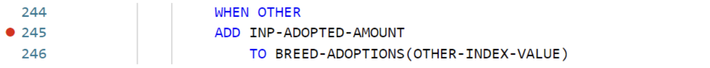

15. We now have 2 breakpoints (you can see them in the breakpoints section in the bottom left corner):

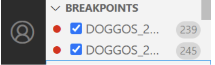

16. Now let’s continue the execution by clicking the play button on the left of the debug toolbar (or F5):

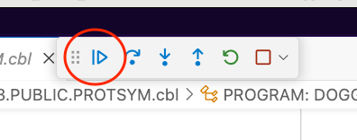

17. We can see that while looping through the breeds the debugger skipped the breakpoint on line 239 and stopped at line 245

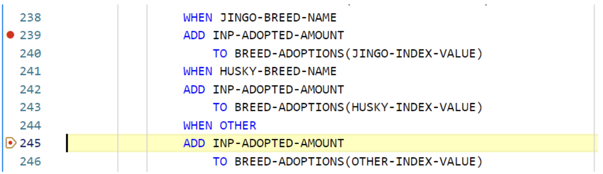

18. Let’s check the variables. Right-click on the INP-ADOPTED-AMOUNT variable and select “Add to watch”
19. Do the same for the INP-DOG-BREED variable on line 216 to understand which breed is analyzed
20. The watched variables will reveal that JINGA is an incorrect breed name, confirming that the input file is the source of the issue (BTW, a quick way is just to hover over a variable name in your extended source and the value will pop up)

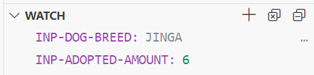

21. Stop the debug session by clicking the stop icon on the debugging toolbar
22. Correct the input file by changing JINGA back to JINGO

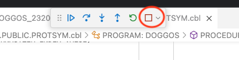

# Additional Exercises
## 1- COBOL Control Flow - CCF
COBOL Control Flow is an extension for Visual Studio Code that provides graphical visualization of program flow for programs written in COBOL. The extension is designed to help COBOL developers to quickly comprehend and debug COBOL programs with which they might not be familiar.

1. Go to File Explorer (second icon in the VSCode Activity Bar)
2. Open the [`DOGGOS.cbl`](DOGGOS/COBOL/DOGGOS.cbl) file under `DOGGOS`/`COBOL` directory
3. Right click in the code editor and select `'Generate COBOL Control Flow'`
4. The DOGGOS program's graphical visualization will appear in a side editor.
    1. Clicking a node highlights the corresponding line in the code editor
    2. Clicking a code line highlights the related node in the graph
    3. Both actions will highlight all nodes that can reach the selected node from the program's root
    4. Unnecessary nodes can be collapsed for a clearer view by clicking the minus sign (`-`)
    5. You can zoom in or out on specific areas, and a snapshot of the visible graph can be downloaded using the toolbar icon in the top right corner
    6. Open the command palette (`CTRL+SHIFT+D` or `COMMAND+SHIFT+D` or `F1 key`), type `COBOL Control Flow` to see the supported export options
    7. Close the graph using the `X` icon on the editor tab or  `CTRL+W` or `COMMAND+W`

## 2- COBOL Language Support - COBOL LS
COBOL Language Support enhances the COBOL programming experience on your IDE. The extension leverages the language server protocol to provide autocomplete, syntax highlighting and coloring, and diagnostic features for COBOL code and copybooks.

1. Go to File Explorer (second icon in the VSCode Activity Bar)
2. Open the [`DOGGOS.cbl`](DOGGOS/COBOL/DOGGOS.cbl) file under `DOGGOS`/`COBOL` directory
    1. Scroll to line `39`, right click on the `SHIBA-INDEX-VALUE` and select `Go to References` to view all instances where the variable is used.
    2. Scroll to line `184`, right click on the `SHIBA-BREED-NAME` and select `Go to Definition`  to see the definition of the variable.
    3. Scroll to line `27`, right click on the copybook name `ADOPTRPT` and select `Go to Definition` to open the selected copybook file in another code editor, allowing you to view its content.
    4. Add a new line below line `35`, type `PROC` and observe the recommendations in the intellisense view. You can explore other COBOL keywords using the up or down arrow keys and read the snippets describing the selected keyword. 

        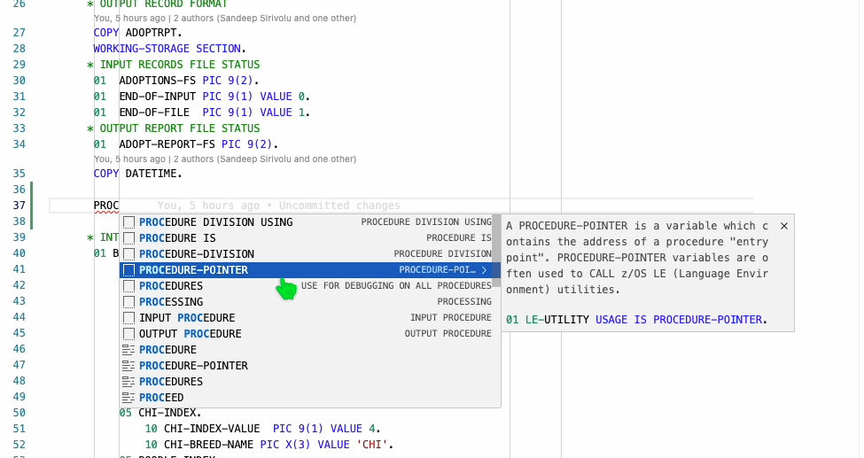
